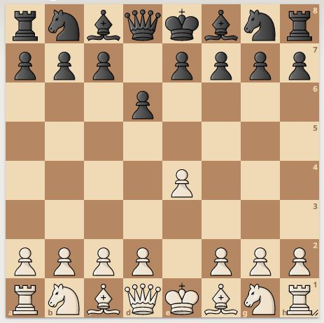

# Spaced Repetition Chess Openings

## Bakgrund

Avsikten med denna app är att träna in de vanligaste öppningarna.  
Det är inte självklart att det handlar om de bästa dragen,  
däremot de populäraste bland schackspelare med FIDE-rating över 2200.  
Spelöppningsfällor saknas här, eftersom sådana drag innebär att man medvetet spelar ett sämre drag,  
för att hamna i en ovanlig ställning, som motståndaren förhoppningsvis inte är bekant med,  
och därmed gör bort sig eller förlorar på tid.  
Spelar båda spelarna de bästa dragen hamnar man ganska nära noll i dator-utvärdering.  

För att en ställning ska avföras, måste man angivit rätt drag, fem gånger i följd.

# Hur man väljer ut frågor.

* Välj ut lådan med högst relativ fyllnadsgrad.
* Kapaciteterna är [1,3,9,27,81] kort för de olika lådorna.
* Lådorna fungerar som köer.
	* Nya kort läggs in i slutet av lådan.
	* Kort plockas ut från början av lådan.
```
Låda 0: d2d4.d7d5 e2e4.e7e5 d2d4.d7d5.c2c4 g2g3 (5 kort)
Låda 1: a2a4 b2b4 c2c4 d2d4 e2e4 f2f4 g2g4 h2h4 g1f3 b1c3 e2e3 (11 kort)
Låda 2: c2c4.c7c5
Låda 3:
Låda 4:
```

Låda 1 överstiger maxantalet, 11 > 10.  
Därför hämtas sista kortet, e2e3.  
Svarar man rätt på denna fråga, flyttas kortet från Låda 1 till Låda 2.  
Svarar man fel, läggs kortet först i Låda 0.  
Då låda 4 passerats, kastas kortet bort, eftersom man svarat rätt fem gånger i rad.  

Rätt:
```
Låda 0: e2e3 d2d4.d7d5 e2e4.e7e5 d2d4.d7d5.c2c4 g2g3 (6 kort)
Låda 1: a2a4 b2b4 c2c4 d2d4 e2e4 f2f4 g2g4 h2h4 g1f3 b1c3 (10 kort)
Låda 2: c2c4.c7c5
Låda 3:
Låda 4:
```

Fel:
```
Låda 0: d2d4.d7d5 e2e4.e7e5 d2d4.d7d5.c2c4 g2g3 (5 kort)
Låda 1: a2a4 b2b4 c2c4 d2d4 e2e4 f2f4 g2g4 h2h4 g1f3 b1c3 (11 kort)
Låda 2: e2e3 c2c4.c7c5
Låda 3:
Låda 4:
```

# GUI:



Utför det vanligaste draget!
(tryck på mellanslag för facit)

# Hur många drag godkännes?
Om kvoten mellan tvåan och ettan är större än 0.8 godkänns tvåan.  
Samma sak gäller trean och tvåan, osv.
De tal man använder är antalet partier, dvs popularitetsordning.

# Hur många drag väljs ut?
Från vald spelöppning väljs alla spelade partier ut.  
Positionerna visas i popularitetsordning.  
Dvs, man tränas på de vanligaste ställningarna först,  
och kan avbryta då man börjar nå ovanliga ställningar.  
Italienskt parti består 6875 halvdrag.  

T ex bör man på e4 svara med c5. Dock får man  
frågor även på t ex e5 och andra drag senare.  

# Anki

* Anki har fem boxar.
* Den första innehåller de nyaste uppgifterna.
* När man svarat rätt, flyttas kortet till nästa box.
* Efter femte boxen, tas kortet bort.
* När man svarar fel, flyttas kortet tillbaka till första boxen.
* Korten i varje box ligger i en kö.
* Varje låda har ett maxantal. Default: [5,10,20,40,80]
* Korten i högsta lådan ligger därmed längst i tid räknat.
